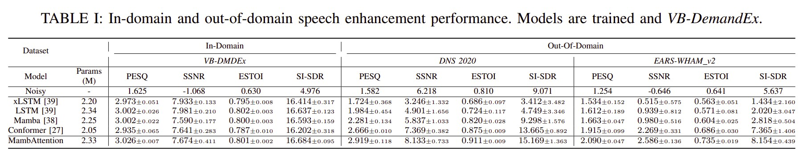

# MambAttention: Mamba with Multi-Head Attention for Generalizable Single-Channel Speech Enhancement

This is the official implementation of the [MambAttention: Mamba with Multi-Head Attention for Generalizable Single-Channel Speech Enhancement](https://arxiv.org/abs/2507.00966v1) paper.

---


## Requirement
    * Python >= 3.9
    * CUDA >= 12.0
    * PyTorch == 2.2.2

## Model


## Speech Enhancement Results
### Speech enhancement generalization performance:


## Audio Examples (model weights will be released soon)
A selection of audio samples on the out-of-domain datasets can be found [here](https://github.com/NikolaiKyhne/MambAttention/tree/main/audio_examples).

## Installation

### Step 1 - Install PyTorch

Install PyTorch 2.2.2 from the official website. Visit [PyTorch Previous Versions](https://pytorch.org/get-started/previous-versions/) or [For Slurm based systems](https://hub.docker.com/r/pytorch/pytorch/tags)).

### Step 2 - Install Required Packages

After setting up the environment and installing PyTorch, install the required Python packages listed in requirements.txt.

```bash
pip install -r requirements.txt
```

### Step 3 - Install the Mamba Package

Navigate to the mamba_install directory and install the package. This step ensures all necessary components are correctly installed.

```bash
cd mamba_install
pip install .
```

Note: Installing from source (provided `mamba_install`) can help prevent package issues and ensure compatibility between different dependencies. It is recommended to follow these steps carefully to avoid potential conflicts.

## Training the Model

### Step 1: Download VBDemandEx Dataset (and possibly OOD datasets)
Download the VB-DemandEx dataset from Hugging Face using the code provided [here](https://github.com/NikolaiKyhne/MambAttention/blob/main/download_dataset.py).

We refer to the official repositories for the [DNS 2020](https://github.com/microsoft/DNS-Challenge/tree/interspeech2020/master) and [Expressive Anechoic Recordings of Speech (EARS)](https://github.com/facebookresearch/ears_dataset) & [Generation scripts for EARS-WHAM and EARS-Reverb](https://github.com/sp-uhh/ears_benchmark).

### Step 2: Prepare Dataset JSON

Create the dataset JSON file using the script `data/make_dataset_json.py`. You may need to modify the data paths in `data/make_dataset_json.py` to match the dataset folder location.

### Step 3: Run the following command to train the model.

Modify the `--exp_name`, `--exp_folder`, and `--config` parameters in the command to match your folder structure.

```bash
NCCL_P2P_DISABLE=1 torchrun --nnodes=1 --nproc-per-node=4 MambAttention/train.py --exp_name=seed3441 --exp_folder=results/ --config=MambAttention/checkpoints/MambAttention_seed3441_VB-DemandEx.yaml
```

## Running Inference

Modify the `--input_folder` and `--output_folder` parameters to point to your desired input and output directories. Then, run the script.

```bash
NCCL_P2P_DISABLE=1 python MambAttention/inference.py --input_folder=VB-DemandEx/noisy_test --output_folder=output --checkpoint_file=results/seed3441/g_00xxxxxx.pth --config=MambAttention/checkpoints/MambAttention_seed3441_VB-DemandEx.yaml
```

Model weights and training recipe can be found in: (WILL BE ADDED SOON!) and [MambAttention Recipe](checkpoints/MambAttention_seed3441_VB-DemandEx.yaml) is now available.


## Evaluation
The evaluation metrics is calculated via: [CMGAN](https://github.com/ruizhecao96/CMGAN/blob/main/src/tools/compute_metrics.py)  


## Citation:
If you find the paper useful in your research, please cite:  
```
@article{kuehne2025mambattention
  title={MambAttention: Mamba with Multi-Head Attention for Generalizable Single-Channel Speech Enhancement},
  author={Nikolai Lund Kühne and Jan Østergaard and Jesper Jensen and Zheng-Hua Tan},
  journal={arXiv preprint arXiv:2507.00966},
  year={2025}
}
```

## References and Acknowledgements
We would like to express our gratitude to the authors of [xLSTM-SENet](https://github.com/NikolaiKyhne/xLSTM-SENet), [SEMamba](https://github.com/RoyChao19477/SEMamba), [MP-SENet](https://github.com/yxlu-0102/MP-SENet/tree/main), and [CMGAN](https://github.com/ruizhecao96/CMGAN).
